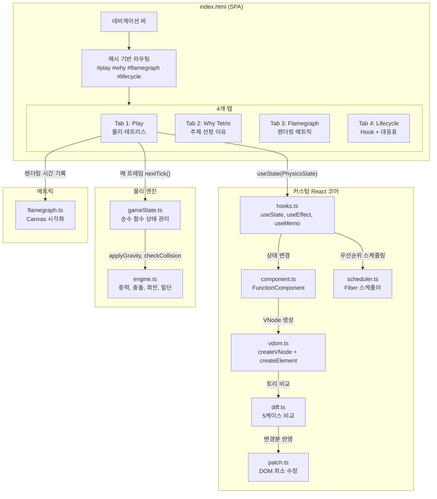
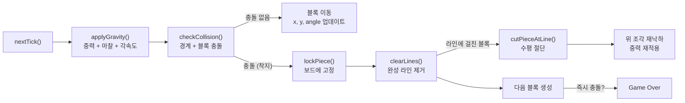
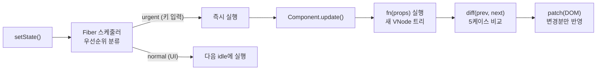

# 물리 테트리스 — 커스텀 React로 만든 Physics-Based Tetris

> "블록이 기울어지면 라인은 어떻게 클리어될까?"

커스텀 React 구현체(Virtual DOM, Hooks, Fiber) 위에서 동작하는 **물리 기반 테트리스**입니다.
외부 프레임워크 없이, 순수 TypeScript로 React의 핵심 메커니즘을 직접 구현하고
이를 증명하기 위해 **360도 회전 + 라인 절단** 테트리스를 만들었습니다.

---

## 왜 물리 테트리스인가?

일반 테트리스는 그리드 기반입니다. 블록은 90도 단위로 회전하고, 라인은 행 단위로 깔끔하게 사라집니다.

**물리 테트리스는 다릅니다:**

- 블록이 **실제 각도로 기울어지며** 떨어짐
- 기울어진 블록이 라인에 걸쳐있으면 **수평으로 절단**됨
- 절단된 위 조각이 다시 **중력과 충돌의 영향**을 받아 떨어짐
- Q/E키로 **360도 자유 회전**, ↑키로 **90도 즉시 회전**

이 복잡한 물리 시뮬레이션을 React의 **상태 관리(useState)**, **게임 루프(useEffect)**, **충돌 캐싱(useMemo)**, **배칭(Batching)** 으로 처리하며, 각 Hook이 왜 필요한지를 게임 플레이로 직접 증명합니다.

---

## 실행 방법

```bash
# 1. 의존성 설치
npm install

# 2. 테스트 실행
npm test

# 3. 타입 체크
npx tsc --noEmit

# 4. 개발 서버
npm run dev
```

브라우저에서 `http://localhost:5173` 접속

---

## 조작법

| 키 | 동작 |
|----|------|
| ← → | 좌우 이동 |
| ↑ | 90도 즉시 회전 (전통 테트리스 스타일) |
| Q | 반시계방향 자유 회전 (물리 기반, 마찰로 감속) |
| E | 시계방향 자유 회전 (물리 기반, 마찰로 감속) |
| ↓ | 소프트 드롭 (가속 낙하) |
| Space | 하드 드롭 (즉시 착지) |
| R | 블록 보관 (Hold) |

---

## 앱 구조 — SPA, 4개 탭

```
index.html (SPA 진입점)
│
├── 네비게이션: [🎮 Play] [🧩 Why Tetris] [📊 Flamegraph] [⚙️ Lifecycle]
│
├── Tab 1: Play           ← 물리 테트리스 게임 플레이
├── Tab 2: Why Tetris     ← 주제 선정 이유 + 컴포넌트 트리 시각화 + 라인 절단 시연
├── Tab 3: Flamegraph     ← 실시간 렌더링 메트릭 패널
└── Tab 4: Lifecycle      ← Hook 배치 시각화 + 구현 대응표
```

---

## 아키텍처

### 전체 시스템 구조



### 물리 엔진 파이프라인 — 매 프레임 처리 순서



### 커스텀 React 렌더링 파이프라인



---

## 물리 시스템 — 일반 테트리스와의 차이

```
[일반 테트리스]
블록 = 그리드 단위 이동
회전 = 90도 단위
라인 = 행 전체 삭제

[물리 테트리스]
블록 = 실수 좌표 이동 (x, y, angle, vx, vy)
회전 = 360도 자유 회전 (angularVelocity + 마찰 감쇠)
라인 = 기울어진 블록 수평 절단 후 위 조각 재낙하
```

### 블록별 고유 색상

| 블록 | 색상 | 코드 |
|------|------|------|
| I | 시안 | `#00f0f0` |
| J | 파랑 | `#0000f0` |
| L | 주황 | `#f0a000` |
| O | 노랑 | `#f0f000` |
| S | 초록 | `#00f000` |
| Z | 빨강 | `#f00000` |
| T | 보라 | `#a000f0` |

### 라인 절단 — 이 프로젝트의 핵심 차별점

```
[기울어진 블록이 라인에 걸친 상태]

    ╲█╲
  ───█─█─── ← 완성된 라인
     ╲█╲

[cutPieceAtLine() 실행 후]

    ╲█         ← 위 조각: 다시 중력 적용, 재낙하
  ─────────── ← 라인 제거됨
               ← 아래 조각: 삭제됨
```

---

## Hook을 게임에 어떻게 배치했나?

```
useState
├── 게임 전체 상태 (PhysicsState)
├── 다음 블록 (nextPiece)
└── 보관 블록 (heldPiece, 1개 제한)

useEffect
├── 게임 루프 시작 (mount 시)
├── 블록 착지 감지
├── 키보드 이벤트 등록
│   (←→ 이동, ↑ 90도회전, Q/E 자유회전,
│    ↓ 소프트드롭, SPC 하드드롭, R 홀드)
└── cleanup → 루프/이벤트 해제

useMemo
└── 충돌 감지 결과 캐싱
    블록 위치 바뀔 때만 재계산

Batching → Fiber 스케줄러
└── 이동(x) + 중력(y) + 회전(angle)
    setState 3번 → 렌더링 1번
```

---

## 개발하면서 발견한 문제들

> "이렇게 만들었다"가 아니라 "이런 문제를 발견해서 이걸 추가했다"

| # | 문제 | 원인 | 해결 | React 대응 |
|---|------|------|------|------------|
| 1 | 블록이 움직일 때마다 버벅임 | setState 3번 → 렌더링 3번 | Batching 구현 | automatic batching |
| 2 | 게임 재시작 시 루프 중복 실행 | useEffect cleanup 미구현 | cleanup에서 cancelAnimation | componentWillUnmount |
| 3 | 60fps에서 충돌 계산 과부하 | 매 프레임 전체 블록 충돌 재계산 | useMemo로 deps 변경 시만 재계산 | useMemo |
| 4 | hooks[] 순서 꼬임 | hookIndex 초기화 누락 | mount/update 시 hookIndex = 0 | Rules of Hooks |
| 5 | R키 연속 입력 시 블록 무한 교체 | canHold 플래그 없음 | 착지 시 canHold = true 복원 | 게임 로직 제약 |
| 6 | 게임 루프와 UI 업데이트 경쟁 | BatchScheduler가 동일 우선순위로 처리 | Fiber 스케줄러: urgent > normal > idle | React Fiber |

---

## 구현 대응표

| 우리 구현 | Real React 대응 | 역할 |
|-----------|----------------|------|
| `createVNode()` | `React.createElement()` | VNode 객체 생성 |
| `diff()` 5케이스 | `Reconciler` | 두 트리 비교, 변경점 추출 |
| `patch()` | `commitWork()` | 변경점을 실제 DOM에 반영 |
| `Component` class | `FunctionComponent` | 함수형 컴포넌트 생명주기 관리 |
| `hooks[] + hookIndex` | `Fiber.memoizedState` | Hook 상태 저장소 |
| `mount() / update()` | `Reconciler` | 마운트/업데이트 생명주기 |
| `Fiber 스케줄러` | `scheduler workLoop` | 우선순위 기반 작업 분할 |
| `BatchScheduler` | `automatic batching` | 여러 setState를 모아 한 번에 |
| `useEffect cleanup` | `componentWillUnmount` | 리소스 해제 |

**"우리가 겪은 문제가 React가 이 기능을 만든 이유와 동일했습니다."**

---

## Flamegraph — 렌더링 성능 시각화

게임 플레이 중 각 컴포넌트의 렌더링 시간을 **실시간 Canvas Flamegraph**로 시각화합니다.

```
commit →  1   2   3   4   5  ...
TetrisApp █   █   █   █   █
Block     ██  ██  ██  ██  ██
Board     █
Score                     █
Preview       █               █

노란색 = 오래걸림   초록색 = 빠름
```

**핵심 관찰:**
- Block만 매 프레임 렌더링됨
- Score는 점수 바뀔 때만 렌더링됨
- Board는 블록 고정 시에만 렌더링됨
- **→ Component 분리 = 불필요한 렌더링 제거**

---

## 파일 구조

```
src/
├── core/                    # 커스텀 React 코어
│   ├── vdom.ts              # createVNode, createElement (민철)
│   ├── diff.ts              # diff 알고리즘 5케이스 (민철)
│   ├── patch.ts             # DOM 패치 (민철)
│   ├── component.ts         # FunctionComponent 생명주기 (민철)
│   ├── hooks.ts             # useState, useEffect, useMemo, Batching (명석)
│   └── scheduler.ts         # Fiber 우선순위 스케줄러 (명석)
│
├── physics/                 # 물리 엔진 (지용)
│   ├── matterEngine.ts      # Matter.js 엔진 초기화, 벽/바닥, 테트로미노 생성
│   ├── matterState.ts       # 게임 상태 관리 (force 기반 이동, torque 회전)
│   ├── matterLinecut.ts     # 면적 기반 라인 밀도 + Sutherland-Hodgman 절단
│   ├── matterRenderer.ts    # Canvas 다각형 렌더링
│   ├── engine.ts            # 그리드 기반 물리 (레거시, 테스트용)
│   ├── engine.test.ts       # 물리 엔진 유닛 테스트
│   ├── gameState.ts         # 그리드 기반 상태 관리 (레거시, 테스트용)
│   └── gameState.test.ts    # 게임 상태 유닛 테스트
│
├── metrics/                 # 메트릭 (지용)
│   ├── flamegraph.ts        # Canvas Flamegraph 시각화
│   └── flamegraph.test.ts   # Flamegraph 유닛 테스트
│
└── app/                     # 통합 (지용)
    ├── index.ts             # 진입점, 탭 라우팅
    ├── tabs/
    │   ├── play.ts          # Tab 1: 게임 플레이
    │   ├── why.ts           # Tab 2: 주제 선정 이유
    │   ├── flamegraph.ts    # Tab 3: 메트릭 패널
    │   └── lifecycle.ts     # Tab 4: Hook 시각화 + 대응표
    └── style.css            # 전체 레이아웃

contracts.ts                 # 공용 인터페이스 계약 (수정 시 팀장 승인 필수)
```

---

## 협업 방법

### 역할 분담

| 담당 | 작업 범위 |
|------|----------|
| 민철 | `src/core/` — VDOM, Diff, Patch, Component |
| 명석 | `src/core/hooks.ts`, `scheduler.ts` — Hooks, Batching, Fiber |
| 지용 | `src/physics/`, `src/metrics/`, `src/app/` — 물리 엔진, 메트릭, 통합 |

### 인터페이스 계약

`contracts.ts`를 **유일한 기준**으로 사용합니다.
모든 팀원은 이 파일의 타입과 시그니처를 기준으로 병렬 개발합니다.

### Git 브랜치 전략

```
main
└── dev
    ├── feat/vdom-diff        # 민철
    ├── feat/hooks            # 명석
    ├── feat/physics          # 지용 — 물리 엔진
    ├── feat/flamegraph       # 지용 — 메트릭
    └── feat/app              # 지용 — 통합
```

### Commit Convention

Angular Commit Convention, body는 한글로 작성합니다.

```
feat(physics): 물리 엔진 기반 함수 구현

- applyGravity: 중력/마찰/각속도 감쇠 적용
- checkCollision: 보드 경계 및 기존 블록과의 충돌 감지
- rotatePiece: 각도 기반 회전 (90도 단위가 아닌 실제 각도)
```

---

## 테스트

```bash
npm test
```

| 영역 | 테스트 수 | 내용 |
|------|----------|------|
| 물리 엔진 | 31개 | 중력, 충돌, 회전(CW/CCW), 90도 회전, 라인 절단, 클리어 |
| 게임 상태 | 35개 | initState, nextTick, movePiece, hardDrop, holdPiece, softDrop, rotatePieceInState, snapRotateInState |
| VDOM/Diff/Patch | 26개 | createVNode, diff 5케이스, patch, Component mount/update/unmount |
| Flamegraph | 9개 | record, render, clear, mock data 검증 |
| **합계** | **101개** | 전체 통과 |

---

## 기술 스택

- **TypeScript** — UI 프레임워크 사용 금지, React 핵심 직접 구현
- **Matter.js** — 2D 물리 엔진 (Box2D 수준 충돌/중력/마찰)
- **Vitest** — 유닛 테스트
- **Canvas API** — 게임 보드 + Flamegraph 시각화
- **Vite** — 번들러
- **HTML/CSS** — 4탭 SPA 레이아웃

---

## 마일스톤 진행 상황

| M | 목표 | 상태 |
|---|------|------|
| M1 | 물리 엔진 기반 함수 (중력, 충돌, 회전) | ✅ |
| M2 | 라인 절단 및 클리어 | ✅ |
| M3 | 게임 상태 관리 + Hold Piece | ✅ |
| M4 | Flamegraph 메트릭 패널 | ✅ |
| M5 | 4탭 SPA 전체 통합 | ✅ |
| M6 | 순수 TS 물리 시도 → Matter.js 회귀 | ✅ (아래 참고) |

---

## 순수 TS 물리 엔진 시도 → Matter.js 회귀

### 시도한 것

SAT(분리축 정리) 기반 충돌 감지, impulse 반응, 수동 중력/마찰을 순수 TypeScript로 구현했습니다.
10회 이상의 수정 사이클을 거쳤지만 3가지 근본 문제가 해결되지 않았습니다:

| 문제 | 원인 | 시도한 해결 |
|------|------|------------|
| 블록 겹침 | SAT 충돌 해소 1~2회 반복으로는 불충분 | 보정 비율 조정, 반복 횟수 증가 |
| 파편 미낙하 | clearCooldown 중 물리 skip, isStatic 판정 오류 | 쿨다운 중 파편만 물리 실행 |
| 착지 오판 | 충돌 보정(위로 밀기)과 착지 판정(아래 체크) 상충 | 예측 거리 조정, lockTimer 리셋 제거 |

### 교훈

> **"바퀴를 재발명하지 말라"** — 물리 엔진은 수천 줄의 반복적 constraint solver가 필요합니다.
> Matter.js(Box2D 수준)는 이를 검증된 방식으로 제공합니다.
> 프로젝트의 핵심은 **custom React 구현**이므로, 물리는 검증된 라이브러리를 사용하고
> React의 핵심(VDOM, Hooks, Fiber)을 직접 구현하는 데 집중했습니다.

### 보존된 코드

순수 TS 물리 시도 코드는 `.bak`, `.old`, `.legacy` 확장자로 보존되어 있습니다:
- `engine2d.ts.bak` — SAT 충돌 감지, 중력, 벽 충돌
- `notTetrisState.ts.bak` — 순수 함수 게임 상태 관리
- `renderer.ts.bak` — Canvas 다각형 렌더링
- `linecut.ts.bak` — Sutherland-Hodgman 다각형 절단

---

## 배운 점

1. **블록 하나가 Component 하나** — 테트리스 블록의 위치·각도·속도가 곧 Component의 State
2. **useState는 게임 상태의 핵심** — PhysicsState 하나로 보드, 블록, 점수를 모두 관리
3. **useEffect는 게임 루프** — requestAnimationFrame을 useEffect로 시작하고 cleanup으로 정리
4. **useMemo는 60fps의 비밀** — 매 프레임 충돌 계산을 캐싱하여 프레임 드롭 방지
5. **Batching 없으면 게임이 안 된다** — 이동+중력+회전 setState 3번이 렌더링 3번이면 버벅임
6. **Fiber는 양보의 기술** — 키 입력(urgent)은 즉시, 메트릭(idle)은 여유있을 때
7. **라인 절단이 React의 가치를 증명** — 복잡한 상태 변화를 선언적으로 처리할 수 있는 이유
8. **바퀴를 재발명하지 말라** — 물리 엔진은 검증된 라이브러리를, React 핵심은 직접 구현을
